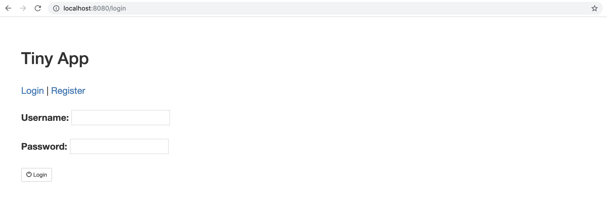
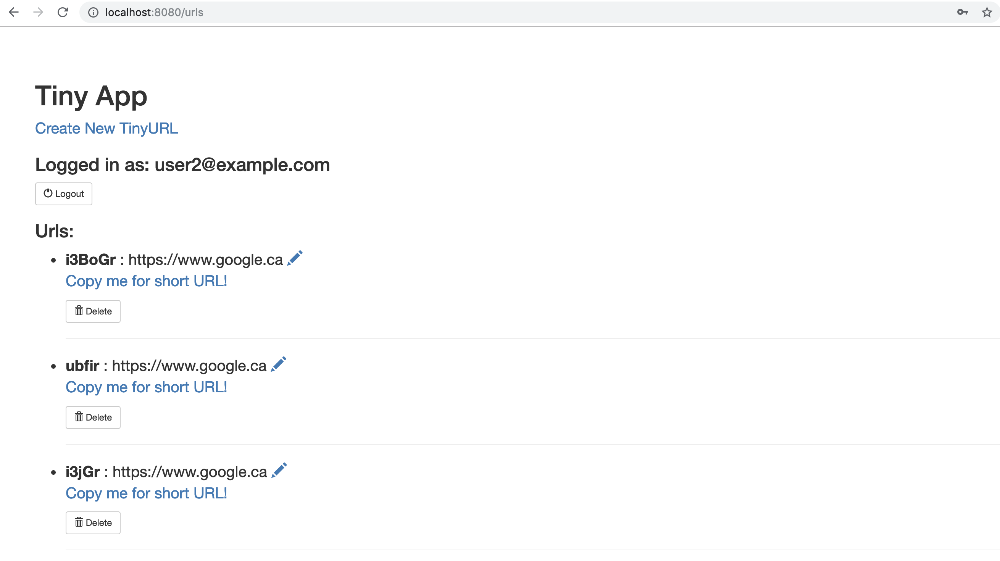
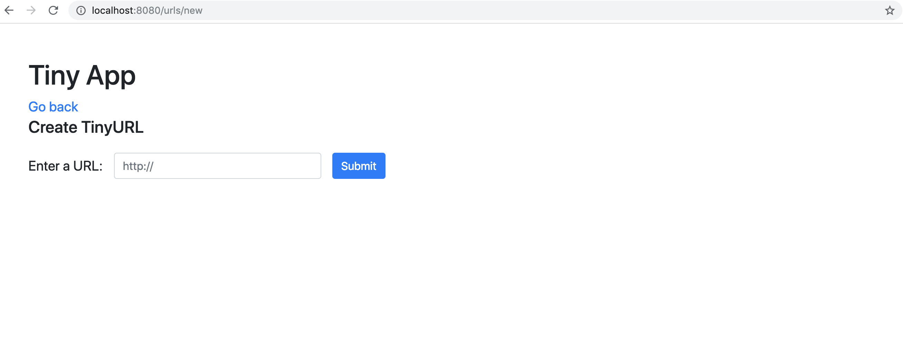
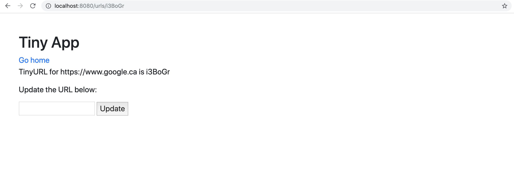

### TinyApp Project ###

 Tiny App is a full stack web application, built using Node and Express, that allows users to shorten URLs.

## Final Product

## Dependencies

Node.js
Express
EJS
bcrypt
body-parser
cookie-parser

## Getting Started

- Install all dependencies using 'npm install' command.
- Run web server using 'node express_server.js' command.
